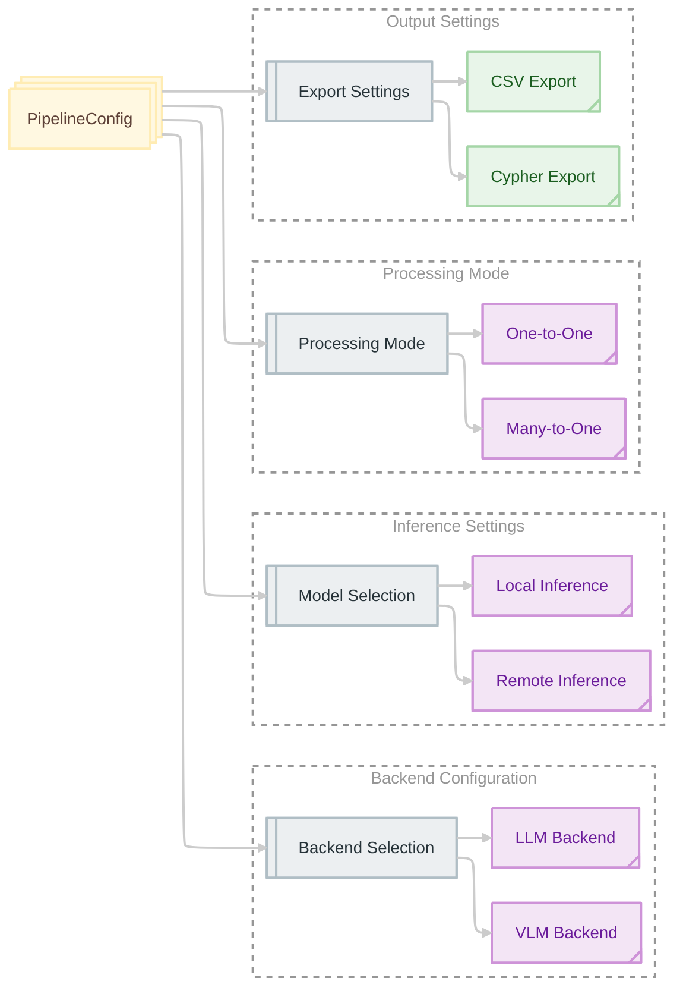

```mermaid
%%{init: {'theme': 'redux-dark', 'look': 'default', 'layout': 'elk'}}%%
flowchart LR
    %% 1. Define Classes
    classDef input fill:#E3F2FD,stroke:#90CAF9,color:#0D47A1
    classDef config fill:#FFF8E1,stroke:#FFECB3,color:#5D4037
    classDef output fill:#E8F5E9,stroke:#A5D6A7,color:#1B5E20
    classDef decision fill:#FFE0B2,stroke:#FFB74D,color:#E65100
    classDef data fill:#EDE7F6,stroke:#B39DDB,color:#4527A0
    classDef operator fill:#F3E5F5,stroke:#CE93D8,color:#6A1B9A
    classDef process fill:#ECEFF1,stroke:#B0BEC5,color:#263238

    %% Subgraph Styling (Transparent with dashed border for visibility)
    classDef subgraph_style fill:none,stroke:#969696,stroke-width:2px,stroke-dasharray: 5,color:#969696

    %% 2. Define Nodes & Subgraphs
    A@{ shape: procs, label: "PipelineConfig" }

    subgraph Backends ["Backend Configuration"]
        B@{ shape: lin-proc, label: "Backend Selection" }
        F@{ shape: tag-proc, label: "LLM Backend" }
        G@{ shape: tag-proc, label: "VLM Backend" }
    end

    subgraph Models ["Inference Settings"]
        C@{ shape: lin-proc, label: "Model Selection" }
        H@{ shape: tag-proc, label: "Local Inference" }
        I@{ shape: tag-proc, label: "Remote Inference" }
    end

    subgraph Strategy ["Processing Mode"]
        D@{ shape: lin-proc, label: "Processing Mode" }
        J@{ shape: tag-proc, label: "One-to-One" }
        K@{ shape: tag-proc, label: "Many-to-One" }
    end

    subgraph Exports ["Output Settings"]
        E@{ shape: lin-proc, label: "Export Settings" }
        L@{ shape: tag-proc, label: "CSV Export" }
        M@{ shape: tag-proc, label: "Cypher Export" }
    end

    %% 3. Define Connections
    A --> B & C & D & E
    
    B --> F & G
    C --> H & I
    D --> J & K
    E --> L & M

    %% 4. Apply Classes
    class A config
    class B,C,D,E process
    class F,G,H,I,J,K operator
    class L,M output
    class Backends,Models,Strategy,Exports subgraph_style
```