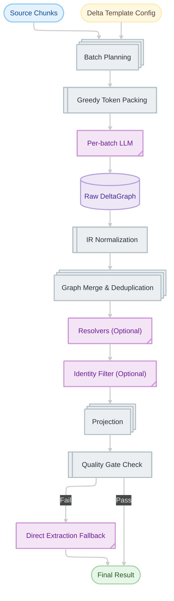

```mermaid
%%{init: {'theme': 'redux-dark', 'look': 'default', 'layout': 'elk'}}%%
flowchart TB
    %% 1. Define Classes
    classDef input fill:#E3F2FD,stroke:#90CAF9,color:#0D47A1
    classDef config fill:#FFF8E1,stroke:#FFECB3,color:#5D4037
    classDef output fill:#E8F5E9,stroke:#A5D6A7,color:#1B5E20
    classDef decision fill:#FFE0B2,stroke:#FFB74D,color:#E65100
    classDef data fill:#EDE7F6,stroke:#B39DDB,color:#4527A0
    classDef operator fill:#F3E5F5,stroke:#CE93D8,color:#6A1B9A
    classDef process fill:#ECEFF1,stroke:#B0BEC5,color:#263238
    
    classDef subgraph_style fill:none,stroke:#969696,stroke-width:2px,stroke-dasharray: 5 5,color:#969696

    %% 2. Define Nodes
    n1@{ shape: terminal, label: "Source Chunks" }
    n2@{ shape: terminal, label: "Delta Template Config" }
    
    n3@{ shape: procs, label: "Batch Planning" }
    n3a@{ shape: lin-proc, label: "Greedy Token Packing" }
    
    n4@{ shape: tag-proc, label: "Per-batch LLM" }
    n5@{ shape: db, label: "Raw DeltaGraph" }
    
    n6@{ shape: lin-proc, label: "IR Normalization" }
    n7@{ shape: procs, label: "Graph Merge & Deduplication" }
    
    n8@{ shape: tag-proc, label: "Resolvers (Optional)" }
    n9@{ shape: tag-proc, label: "Identity Filter (Optional)" }
    
    n10@{ shape: procs, label: "Projection" }
    n11@{ shape: lin-proc, label: "Quality Gate Check" }
    
    n12@{ shape: tag-proc, label: "Direct Extraction Fallback" }
    n13@{ shape: terminal, label: "Final Result" }

    %% 3. Define Connections
    n1 & n2 --> n3
    n3 --> n3a
    n3a --> n4
    n4 --> n5
    n5 --> n6
    n6 --> n7
    
    %% Sequence of Logic
    n7 --> n8
    n8 --> n9
    n9 --> n10
    n10 --> n11
    
    %% Branching Logic
    n11 -- "Pass" --> n13
    n11 -- "Fail" --> n12
    n12 --> n13

    %% 4. Apply Classes
    class n1 input
    class n2 config
    class n5 data
    class n3,n7,n10,n11 process
    class n3a,n6 process
    class n4,n8,n9,n12 operator
    class n13 output
```