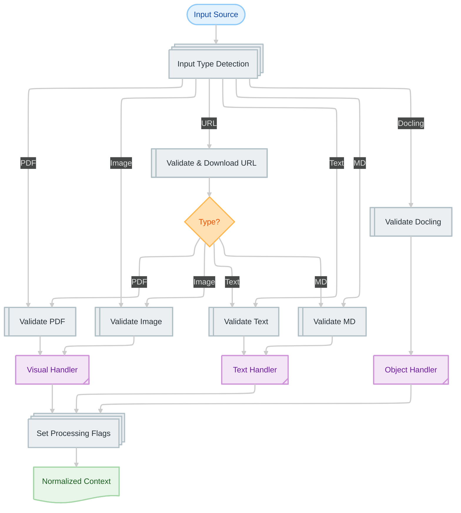

```mermaid
%%{init: {'theme': 'redux-dark', 'look': 'default', 'layout': 'elk'}}%%
flowchart TD
    %% 1. Define Classes
    classDef input fill:#E3F2FD,stroke:#90CAF9,color:#0D47A1
    classDef config fill:#FFF8E1,stroke:#FFECB3,color:#5D4037
    classDef output fill:#E8F5E9,stroke:#A5D6A7,color:#1B5E20
    classDef decision fill:#FFE0B2,stroke:#FFB74D,color:#E65100
    classDef data fill:#EDE7F6,stroke:#B39DDB,color:#4527A0
    classDef operator fill:#F3E5F5,stroke:#CE93D8,color:#6A1B9A
    classDef process fill:#ECEFF1,stroke:#B0BEC5,color:#263238

    %% 2. Define Nodes
    Start@{ shape: terminal, label: "Input Source" }
    Detect@{ shape: procs, label: "Input Type Detection" }

    %% Validators
    ValPDF@{ shape: lin-proc, label: "Validate PDF" }
    ValImg@{ shape: lin-proc, label: "Validate Image" }
    ValText@{ shape: lin-proc, label: "Validate Text" }
    ValMD@{ shape: lin-proc, label: "Validate MD" }
    ValDoc@{ shape: lin-proc, label: "Validate Docling" }
    
    %% URL Specifics
    ValURL@{ shape: lin-proc, label: "Validate & Download URL" }
    CheckDL{"Type?"}

    %% Handlers
    HandVisual@{ shape: tag-proc, label: "Visual Handler" }
    HandText@{ shape: tag-proc, label: "Text Handler" }
    HandDoc@{ shape: tag-proc, label: "Object Handler" }

    %% Outcomes
    SetFlags@{ shape: procs, label: "Set Processing Flags" }
    Output@{ shape: doc, label: "Normalized Context" }

    %% 3. Define Connections
    Start --> Detect
    
    %% Input Detection Routing
    Detect -- PDF --> ValPDF
    Detect -- Image --> ValImg
    Detect -- Text --> ValText
    Detect -- MD --> ValMD
    Detect -- Docling --> ValDoc
    Detect -- URL --> ValURL

    %% URL Routing (Feeds back into validators)
    ValURL --> CheckDL
    CheckDL -- PDF --> ValPDF
    CheckDL -- Image --> ValImg
    CheckDL -- Text --> ValText
    CheckDL -- MD --> ValMD

    %% Validation to Handlers (The "Happy Path")
    ValPDF & ValImg --> HandVisual
    ValText & ValMD --> HandText
    ValDoc --> HandDoc

    %% Converge Handlers to Output
    HandVisual & HandText & HandDoc --> SetFlags --> Output

    %% 4. Apply Classes
    class Start input
    class Detect,SetFlags process
    class ValPDF,ValImg,ValText,ValMD,ValURL,ValDoc process
    class HandVisual,HandText,HandDoc operator
    class CheckDL decision
    class Output output
```