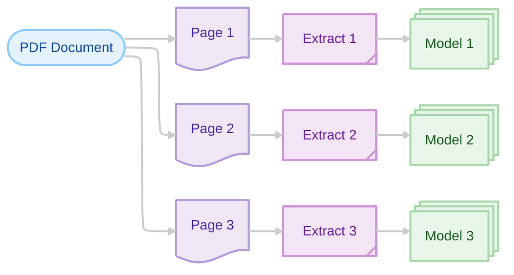

```mermaid
%%{init: {'theme': 'redux-dark', 'look': 'default', 'layout': 'elk'}}%%
flowchart LR
    %% 1. Define Classes
    classDef input fill:#E3F2FD,stroke:#90CAF9,color:#0D47A1
    classDef config fill:#FFF8E1,stroke:#FFECB3,color:#5D4037
    classDef output fill:#E8F5E9,stroke:#A5D6A7,color:#1B5E20
    classDef decision fill:#FFE0B2,stroke:#FFB74D,color:#E65100
    classDef data fill:#EDE7F6,stroke:#B39DDB,color:#4527A0
    classDef operator fill:#F3E5F5,stroke:#CE93D8,color:#6A1B9A
    classDef process fill:#ECEFF1,stroke:#B0BEC5,color:#263238

    %% 2. Define Nodes
    A@{ shape: terminal, label: "PDF Document" }
    
    B@{ shape: doc, label: "Page 1" }
    C@{ shape: doc, label: "Page 2" }
    D@{ shape: doc, label: "Page 3" }
    
    E@{ shape: tag-proc, label: "Extract 1" }
    F@{ shape: tag-proc, label: "Extract 2" }
    G@{ shape: tag-proc, label: "Extract 3" }
    
    H@{ shape: procs, label: "Model 1" }
    I@{ shape: procs, label: "Model 2" }
    J@{ shape: procs, label: "Model 3" }

    %% 3. Define Connections
    A --> B & C & D
    
    B --> E
    C --> F
    D --> G
    
    E --> H
    F --> I
    G --> J

    %% 4. Apply Classes
    class A input
    class B,C,D data
    class E,F,G operator
    class H,I,J output
```