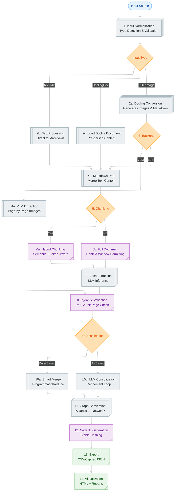

```mermaid
%%{init: {'theme': 'redux-dark', 'look': 'default', 'layout': 'elk'}}%%
flowchart TB
    %% 1. Define Classes
    classDef input fill:#E3F2FD,stroke:#90CAF9,color:#0D47A1
    classDef config fill:#FFF8E1,stroke:#FFECB3,color:#5D4037
    classDef output fill:#E8F5E9,stroke:#A5D6A7,color:#1B5E20
    classDef decision fill:#FFE0B2,stroke:#FFB74D,color:#E65100
    classDef data fill:#EDE7F6,stroke:#B39DDB,color:#4527A0
    classDef operator fill:#F3E5F5,stroke:#CE93D8,color:#6A1B9A
    classDef process fill:#ECEFF1,stroke:#B0BEC5,color:#263238

    %% 2. Define Nodes
    A@{ shape: terminal, label: "Input Source" }
    A1@{ shape: procs, label: "1. Input Normalization<br/>Type Detection & Validation" }
    
    A2{"Input Type"}
    
    %% Ingestion Paths
    B@{ shape: procs, label: "2a. Docling Conversion<br/>Generates Images & Markdown" }
    B2@{ shape: lin-proc, label: "2b. Text Processing<br/>Direct to Markdown" }
    B3@{ shape: lin-proc, label: "2c. Load DoclingDocument<br/>Pre-parsed Content" }
    
    %% Strategy Decision
    C{"3. Backend"}
    
    %% Extraction Paths
    D@{ shape: lin-proc, label: "4a. VLM Extraction<br/>Page-by-Page (Images)" }
    E@{ shape: lin-proc, label: "4b. Markdown Prep<br/>Merge Text Content" }
    
    %% Chunking Logic (LLM Path)
    F{"5. Chunking"}
    G@{ shape: tag-proc, label: "6a. Hybrid Chunking<br/>Semantic + Token-Aware" }
    H@{ shape: tag-proc, label: "6b. Full Document<br/>Context Window Permitting" }
    
    I@{ shape: procs, label: "7. Batch Extraction<br/>LLM Inference" }
    
    %% Convergence & Validation
    J@{ shape: tag-proc, label: "8. Pydantic Validation<br/>Per-Chunk/Page Check" }
    
    K{"9. Consolidation"}
    
    L@{ shape: lin-proc, label: "10a. Smart Merge<br/>Programmatic/Reduce" }
    M@{ shape: lin-proc, label: "10b. LLM Consolidation<br/>Refinement Loop" }
    
    %% Graph & Export
    N@{ shape: procs, label: "11. Graph Conversion<br/>Pydantic → NetworkX" }
    O@{ shape: tag-proc, label: "12. Node ID Generation<br/>Stable Hashing" }
    
    P@{ shape: tag-proc, label: "13. Export<br/>CSV/Cypher/JSON" }
    Q@{ shape: tag-proc, label: "14. Visualization<br/>HTML + Reports" }

    %% 3. Define Connections
    A --> A1
    A1 --> A2
    
    %% Routing Inputs
    A2 -- "PDF/Image" --> B
    A2 -- "Text/MD" --> B2
    A2 -- "DoclingDoc" --> B3
    
    %% Routing to Backend Strategy
    B --> C
    B2 & B3 --> E
    
    %% Backend Decisions
    C -- VLM --> D
    C -- LLM --> E
    
    %% LLM Path: Markdown -> Chunking -> Extraction
    E --> F
    F -- Yes --> G
    F -- No --> H
    
    G --> I
    H --> I
    
    %% VLM Path: Direct to Validation (Skips Chunking)
    D --> J
    
    %% LLM Path: Join Validation
    I --> J
    
    %% Consolidation
    J --> K
    K -- "Rule-Based" --> L
    K -- "AI-Based" --> M
    
    %% Final Stages
    L --> N
    M --> N
    
    N --> O
    O --> P
    P --> Q

    %% 4. Apply Classes
    class A input
    class A1,B,I,N process
    class B2,B3,D,E,L,M process
    class A2,C,F,K decision
    class G,H,J,O operator
    class P,Q output
```